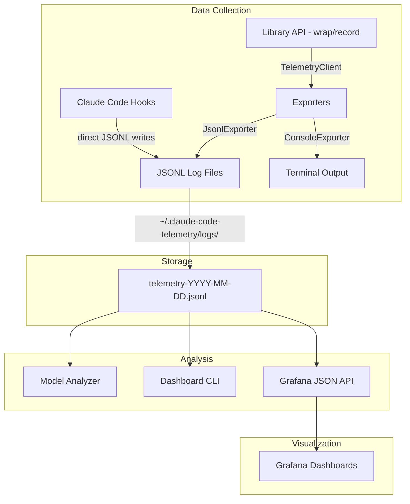

# Claude Code Telemetry

Local-first telemetry system for tracking Claude Code skill invocations, routing decisions, and context budget usage to drive multi-model optimization decisions.

## Architecture



**Two data paths converge on JSONL files:**
- **Hooks** (separate processes): Write directly to JSONL via `appendFile`. Cross-process span tracking uses per-spanId JSON files in `.pending-spans/`.
- **Library API** (in-process): `TelemetryClient` singleton with buffered exports, sampling, and metadata redaction.

## Quick Start

### Library API

```typescript
import {
  TelemetryClient,
  SkillCollector,
  JsonlExporter,
  ConsoleExporter,
} from 'claude-code-telemetry';

// Initialize
const client = TelemetryClient.init({
  enabled: true,
  exporters: [
    new JsonlExporter('~/.claude-code-telemetry/logs', 50),
    new ConsoleExporter('normal'),
  ],
  samplingRate: 1.0,
  redactSensitiveFields: true,
});

// Track skill invocations
const collector = new SkillCollector(client);
const result = await collector.wrap(
  'architect',
  async () => generateArchitecture(prompt),
  { triggerReason: 'explicit_request', modelUsed: 'opus' }
);

// Analyze model recommendations
import { ModelAnalyzer } from 'claude-code-telemetry';
const analyzer = new ModelAnalyzer(events);
const recommendations = analyzer.analyze();
```

### Claude Code Hooks

Register in your Claude Code `settings.json`:

```json
{
  "hooks": {
    "UserPromptSubmit": [
      { "command": "node /path/to/dist/hooks/user-prompt-hook.js" }
    ],
    "Stop": [
      { "command": "node /path/to/dist/hooks/session-stop-hook.js" }
    ],
    "PreToolUse": [
      { "command": "node /path/to/dist/hooks/pre-tool-hook.js" }
    ],
    "PostToolUse": [
      { "command": "node /path/to/dist/hooks/post-tool-hook.js" }
    ]
  }
}
```

### CLI Dashboard

```bash
# View skill usage report
npx claude-telemetry view --report skills

# Model recommendations
npx claude-telemetry view --report model-recs

# Filter by date and skill
npx claude-telemetry view --report skills --date 2026-03-11 --skill architect

# JSON output
npx claude-telemetry view --report skills --format json

# Errors only
npx claude-telemetry view --report skills --errors-only
```

### Grafana Dashboard

```bash
# Start Grafana + API server
cd dashboard && docker compose up

# Open Grafana at http://localhost:3000
# Pre-built dashboards:
#   - Skill Performance (invocations, latency, success rates)
#   - Token Analysis (consumption, context budget)
#   - Model Comparison (cross-model performance)
```

## Configuration

| Option | Default | Description |
|--------|---------|-------------|
| `enabled` | `true` | Enable/disable telemetry |
| `logDir` | `~/.claude-code-telemetry/logs` | JSONL output directory |
| `maxLogFileSizeMB` | `50` | Log rotation threshold |
| `samplingRate` | `1.0` | Event sampling (0.0-1.0) |
| `redactSensitiveFields` | `true` | Redact password/token/secret/key/authorization/credential keys |

## Model Analyzer Thresholds

Default rule-based scoring:

| Model | Tokens | Context % | Other |
|-------|--------|-----------|-------|
| Opus | >= 5000 | >= 30% | Complexity: high |
| Sonnet | 1000-5000 | 10-30% | Success: 90-98% |
| Haiku | <= 1000 | <= 10% | Success: >= 98% |
| Gemini | >= 3000 | >= 40% | Success: >= 95% |

## Development

```bash
npm install
npm test          # Run tests
npm run build     # Compile TypeScript
npm run test:watch # Watch mode
```

## Project Structure

```
src/
  types.ts                    # All type definitions
  telemetry-client.ts         # Singleton client with buffering
  index.ts                    # Public API exports
  utils/
    trace-context.ts          # UUID trace/span management
    token-estimator.ts        # Token counting + context hashing
  exporters/
    jsonl-exporter.ts         # JSONL file writer with rotation
    console-exporter.ts       # Color-coded terminal output
  collectors/
    skill-collector.ts        # Skill invocation wrapping
    orchestration-collector.ts # Routing decision recording
    context-collector.ts      # Context budget snapshots
  hooks/
    shared.ts                 # Hook utilities + pending spans
    user-prompt-hook.ts       # Detects /skill-name patterns
    session-stop-hook.ts      # Closes spans on session end
    pre-tool-hook.ts          # Tool-level pre-invocation
    post-tool-hook.ts         # Tool-level post-invocation
  analysis/
    model-analyzer.ts         # Rule-based model recommendations
    dashboard.ts              # CLI viewer/report generator
dashboard/
  docker-compose.yml          # Grafana + API orchestration
  api/
    server.ts                 # Fastify JSON API for Grafana
  grafana/
    provisioning/             # Auto-config datasources + dashboards
    dashboards/               # Pre-built dashboard JSON files
```
