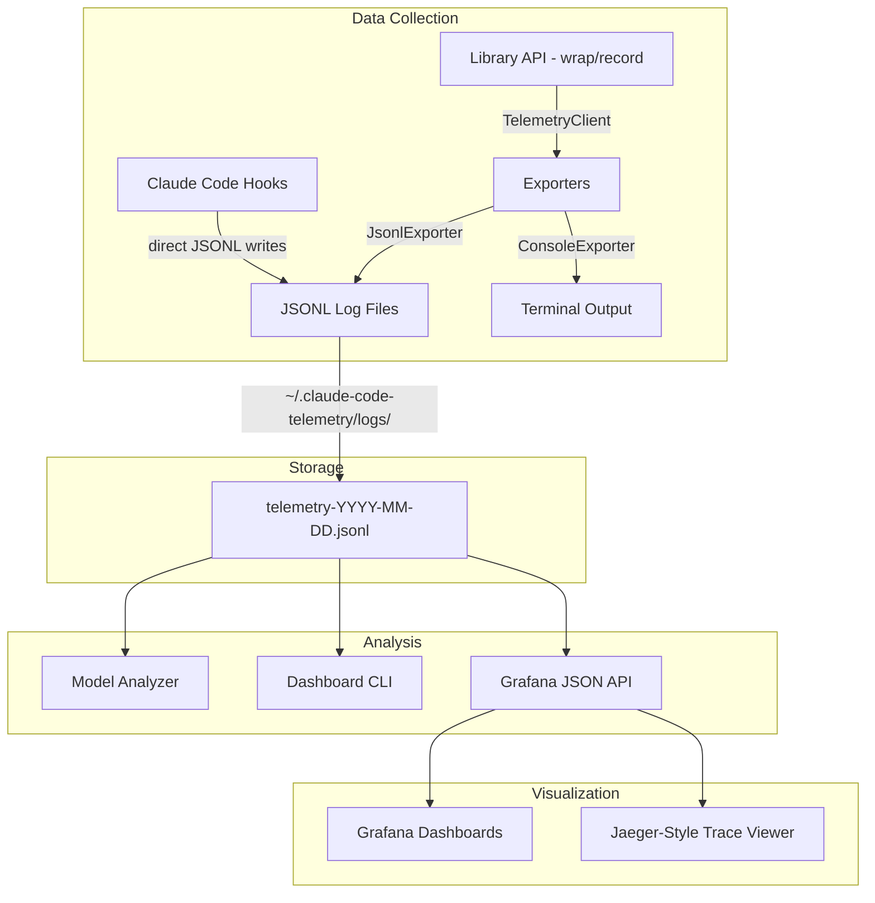

# Claude Code Telemetry

[](https://opensource.org/licenses/MIT)
[](https://nodejs.org)
[](tests/)

Local-first observability system for tracking Claude Code skill invocations, orchestration routing, subagent delegations, and context budget usage — with a built-in Jaeger-style trace waterfall viewer and Grafana dashboards.

**Why?** AI coding agents make hundreds of tool calls per session. Without telemetry, you're flying blind — no visibility into token consumption, success rates, or which skills justify Opus vs. Haiku. This project gives you the same observability you'd expect from a production microservice, applied to your AI agent workflow.

## Features

- **Zero-intrusion instrumentation** via Claude Code hooks — no agent modification needed
- **Distributed tracing** with trace/span hierarchies across skill orchestrations
- **Jaeger-style waterfall viewer** at `/trace/:traceId` with timing bars and collapsible spans
- **Grafana dashboards** for Skill Performance, Token Analysis, and Model Comparison
- **CLI dashboard** for instant terminal-based reports
- **Model analyzer** recommending Opus/Sonnet/Haiku/Gemini per skill based on observed data
- **Subagent tracking** showing orchestrator-to-agent-to-tool delegation flows
- **Append-only JSONL** storage with date-based rotation — no database required

## Architecture



**Two data paths converge on JSONL files:**
- **Hooks** (separate processes): Write directly to JSONL via `appendFile`. Cross-process span tracking uses per-spanId JSON files in `.pending-spans/`.
- **Library API** (in-process): `TelemetryClient` singleton with buffered exports, sampling, and metadata redaction.

## Quick Start

### Installation

```bash
git clone https://github.com/nnaveenraju/claude-code-telemetry.git
cd claude-code-telemetry
npm install
npm run build
```

### Claude Code Hooks

Register hooks in your Claude Code `settings.json` to start capturing telemetry:

```json
{
  "hooks": {
    "UserPromptSubmit": [
      {
        "hooks": [{
          "type": "command",
          "command": "node /path/to/claude-code-telemetry/dist/hooks/user-prompt-hook.js",
          "timeout": 10
        }]
      }
    ],
    "PreToolUse": [
      {
        "hooks": [{
          "type": "command",
          "command": "node /path/to/claude-code-telemetry/dist/hooks/pre-tool-hook.js",
          "timeout": 10
        }]
      }
    ],
    "PostToolUse": [
      {
        "hooks": [{
          "type": "command",
          "command": "node /path/to/claude-code-telemetry/dist/hooks/post-tool-hook.js",
          "timeout": 10
        }]
      }
    ],
    "Stop": [
      {
        "hooks": [{
          "type": "command",
          "command": "node /path/to/claude-code-telemetry/dist/hooks/session-stop-hook.js",
          "timeout": 10
        }]
      }
    ]
  }
}
```

Replace `/path/to/claude-code-telemetry` with your actual install path.

### CLI Dashboard

```bash
# View skill usage report
node dist/analysis/dashboard.js view --report skills

# Model recommendations
node dist/analysis/dashboard.js view --report model-recs

# List all traces with tools and agents used
node dist/analysis/dashboard.js view --report traces

# View a specific trace waterfall
node dist/analysis/dashboard.js view --report trace --trace-id <id>

# Filter by date and skill
node dist/analysis/dashboard.js view --report skills --date 2026-03-11 --skill architect

# JSON output
node dist/analysis/dashboard.js view --report skills --format json
```

### Grafana Dashboard

```bash
# Start Grafana + API server
cd dashboard && docker compose up -d

# Open Grafana at http://localhost:3000
# Jaeger-style trace viewer at http://localhost:4000/trace/<traceId>
```

Pre-built dashboards:
- **Skill Performance** — invocations, latency timelines, success rates
- **Token Analysis** — consumption per skill, context budget gauge
- **Model Comparison** — cross-model invocation and duration tables

### Library API

```typescript
import {
  TelemetryClient,
  SkillCollector,
  JsonlExporter,
  ConsoleExporter,
} from 'claude-code-telemetry';

// Initialize
const client = TelemetryClient.init({
  enabled: true,
  exporters: [
    new JsonlExporter('~/.claude-code-telemetry/logs', 50),
    new ConsoleExporter('normal'),
  ],
  samplingRate: 1.0,
  redactSensitiveFields: true,
});

// Track skill invocations
const collector = new SkillCollector(client);
const result = await collector.wrap(
  'architect',
  async () => generateArchitecture(prompt),
  { triggerReason: 'explicit_request', modelUsed: 'opus' }
);

// Analyze model recommendations
import { ModelAnalyzer } from 'claude-code-telemetry';
const analyzer = new ModelAnalyzer(events);
const recommendations = analyzer.analyze();
```

## Configuration

| Option | Default | Description |
|--------|---------|-------------|
| `enabled` | `true` | Enable/disable telemetry |
| `logDir` | `~/.claude-code-telemetry/logs` | JSONL output directory |
| `maxLogFileSizeMB` | `50` | Log rotation threshold |
| `samplingRate` | `1.0` | Event sampling (0.0-1.0) |
| `redactSensitiveFields` | `true` | Redact password/token/secret/key fields |

## Model Analyzer Thresholds

Default rule-based scoring for multi-model optimization:

| Model | Tokens | Context % | Other |
|-------|--------|-----------|-------|
| Opus | >= 5000 | >= 30% | Complexity: high |
| Sonnet | 1000-5000 | 10-30% | Success: 90-98% |
| Haiku | <= 1000 | <= 10% | Success: >= 98% |
| Gemini | >= 3000 | >= 40% | Success: >= 95% |

## Development

```bash
npm install
npm test           # Run all 54 tests
npm run build      # Compile TypeScript to dist/
npm run test:watch # Watch mode
```

See [CONTRIBUTING.md](CONTRIBUTING.md) for development guidelines.

## Project Structure

```
src/
  types.ts                    # All type definitions
  telemetry-client.ts         # Singleton client with buffering
  index.ts                    # Public API exports
  utils/
    trace-context.ts          # UUID trace/span management
    token-estimator.ts        # Token counting + context hashing
  exporters/
    jsonl-exporter.ts         # JSONL file writer with rotation
    console-exporter.ts       # Color-coded terminal output
  collectors/
    skill-collector.ts        # Skill invocation wrapping
    orchestration-collector.ts # Routing decision recording
    context-collector.ts      # Context budget snapshots
  hooks/
    shared.ts                 # Hook utilities + pending spans
    user-prompt-hook.ts       # Traces every user message
    session-stop-hook.ts      # Closes spans on session end
    pre-tool-hook.ts          # Tool-level + subagent delegation tracking
    post-tool-hook.ts         # Tool completion + subagent return tracking
  analysis/
    model-analyzer.ts         # Rule-based model recommendations
    dashboard.ts              # CLI viewer/report generator
dashboard/
  docker-compose.yml          # Grafana + API orchestration
  api/
    server.ts                 # Fastify JSON API + Jaeger trace viewer
  grafana/
    provisioning/             # Auto-config datasources + dashboards
    dashboards/               # Pre-built dashboard JSON files
tests/                        # 11 test files, 54 tests
```

## License

[MIT](LICENSE)
