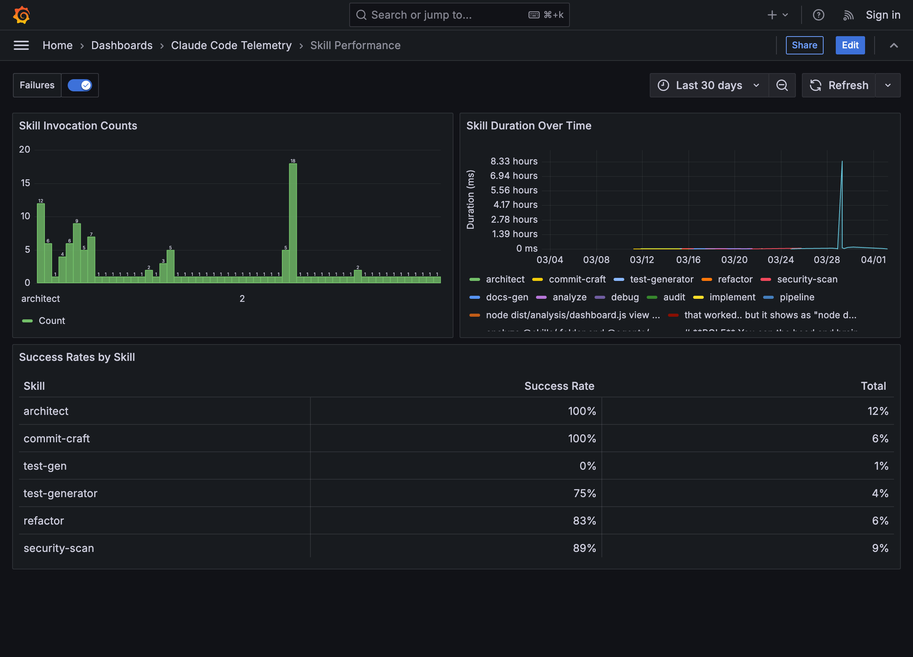

# I Built an Observability Layer for AI Coding Agents — Here's What I Learned

---

When we talk about observability in software, we picture Datadog dashboards, Jaeger traces, and Prometheus metrics. But what about the AI agent that's *writing* your software?

I've been using Claude Code extensively — running skills like `/architect`, `/security-scan`, `/refactor`, and `/audit` daily across multiple projects. After a few weeks, I realized I had zero visibility into what was actually happening:

- Which skills consumed the most tokens?
- Which ones were worth running on Opus vs. Sonnet vs. Haiku?
- When a 25-minute orchestration ran 74 tool calls, what was the execution flow?
- Was I burning context budget on low-value operations?

So I built **Claude Code Telemetry** — an open-source observability system that instruments AI coding agent behavior the same way we instrument microservices.

## The Architecture

The system uses Claude Code's hook system — `UserPromptSubmit`, `PreToolUse`, `PostToolUse`, and `Stop` events — to capture every interaction without modifying the agent itself. It's zero-intrusion instrumentation:

- Every user message starts a **trace** (like a distributed trace in Jaeger)
- Every tool call (Read, Write, Bash, Agent delegation) becomes a **span** within that trace
- Subagent delegations create child spans, so you can see the full orchestration tree
- All data lands in append-only JSONL files — no database required

A Fastify API serves Grafana via the SimpleJSON protocol, and a CLI dashboard gives you instant access from the terminal.

## What the Data Revealed

After collecting real telemetry, some patterns became immediately clear:

1. **`/architect` consistently runs 40-70+ spans** across 1-2 minutes, delegating to `codebase-explorer` and `architecture-reviewer` subagents. It's genuinely Opus-worthy work.

2. **`/commit-craft` uses <5 spans** and finishes in under a second. Running it on Opus is pure waste — Haiku handles it perfectly.

3. **Success rates vary wildly** — `test-generator` at 75% success told me the skill needed debugging, not that I should retry harder.

4. **Context budget correlation** — skills that consumed >40% of the context window correlated with diminishing quality in subsequent turns. Now I know when to start a fresh session.

## The Model Optimization Angle

The real payoff is the model analyzer. It scores each skill across four candidates (Opus, Sonnet, Haiku, Gemini) based on observed token consumption, context budget usage, success rates, and complexity signals. The recommendation engine flags "conflicting signals" when two models score equally — those are the interesting optimization decisions.

## Technical Stack

- TypeScript/ESM, Vitest (54 tests, 100% pass)
- Claude Code hooks (shell scripts receiving JSON via stdin)
- JSONL with date-based rotation
- Fastify + simpod-json-datasource for Grafana
- Docker Compose for the full dashboard stack

## Jaeger-Style Trace Waterfall

One of the features I'm most proud of: a **built-in Jaeger-style trace viewer** that renders the full orchestration flow as a waterfall timeline. Navigate to `/trace/:traceId` and you see every span — from the orchestrator skill, through subagent delegations, down to individual tool calls — with horizontal timing bars, color-coded by type, and collapsible hierarchy.

When `/architect` delegates to `codebase-explorer` which runs 12 Grep calls, then hands off to `architecture-reviewer` — you see the entire flow in one view. No guessing what happened inside a 70-span, 2-minute orchestration.

## Why This Matters Beyond My Setup

As AI coding agents become standard tooling, **we need the same observability practices we apply to production services**. You wouldn't deploy a microservice without metrics and traces. Why would you run an AI agent that makes hundreds of tool calls per session without knowing what it's doing?

If you're running Claude Code, Cursor, or any AI coding agent at scale, think about what you're not measuring. The insights might surprise you.

The project is open source — check it out, fork it, or contribute: **https://github.com/nnaveenraju/claude-code-telemetry**

---

*#AIEngineering #Observability #ClaudeCode #DevTools #LLMOps #OpenSource*
